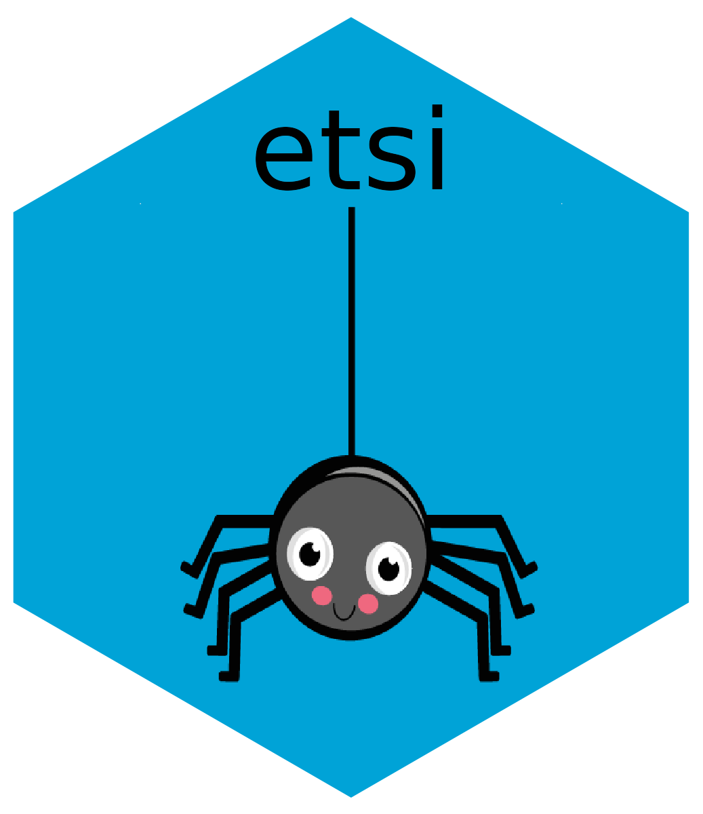

# etsi 

<!-- badges: start put back when on cran-->
<!--   -->
<!-- badges: end -->

`etsi` is an `R` package for treatment effect estimation, hypothesis testing, and future study design for settings where the surrogate is used in place of the primary outcome for individuals for whom the surrogate is valid, and the primary outcome is purposefully measured in the remaining patients. 

More details will be available in the future in: Knowlton R. and Parast L. (2025) ``Efficient Testing Using Surrogate Information."

Go here to view a tutorial for this package: [etsi Tutorial](https://htmlpreview.github.io/?https://github.com/rebeccaknowlton/etsi/blob/main/etsi_tutorial.html)  
